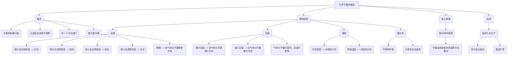

# 影响化学平衡的因素 (教学设计)

> 📅 时间：2026-01-21 14:49 | 🕒 总课时：1

# 第1课时：化学平衡的移动与勒沙特列原理

## 环节一：学习目标

1.  理解化学平衡移动的含义，能判断化学平衡移动的方向。
2.  掌握浓度、压强、温度对化学平衡的影响规律。
3.  理解勒沙特列原理的实质，并能运用其解释和预测化学平衡的移动。
4.  认识催化剂对化学平衡没有影响，但能改变化学反应速率。

## 环节二：情景创设 (3分钟)

**情景选择**: 实验情景 - 硫氰化钾与氯化铁溶液的反应。

**导入**: 教师展示FeCl₃溶液（黄色）和KSCN溶液（无色）。
**提问**: 将两者混合，观察到什么现象？
**学生回答**: 溶液变为血红色。
**教师引导**: 很好，这是 Fe³⁺(aq) + SCN⁻(aq) ⇌ Fe(SCN)²⁺(aq) 的反应。我们知道这是一个可逆反应，最终会达到化学平衡。
**引发认知冲突**: 那么，如果我现在向这个血红色的平衡体系中，再加入一些FeCl₃溶液，或者加入一些KSCN溶液，你猜测会发生什么？如果加入一些能与Fe³⁺反应的物质（如Na₂HPO₄），又会发生什么？为什么？这些操作是否意味着化学平衡可以被“打破”或“改变”？
**过渡**: 今天的课堂，我们就来探究影响化学平衡的因素，并揭示其背后的普遍规律。

## 环节三：任务驱动教学

### 子任务一：探究浓度对化学平衡的影响

1.  **[合作探究]** (15分钟)
    *   **实验器材**: 试管、滴管、FeCl₃溶液（0.1 mol·L⁻¹）、KSCN溶液（0.1 mol·L⁻¹）、Na₂HPO₄溶液（0.1 mol·L⁻¹）、蒸馏水。
    *   **实验步骤**:
        1.  取一支试管，加入少量FeCl₃溶液和KSCN溶液，配制成血红色Fe(SCN)²⁺溶液，作为对照组。
        2.  将上述溶液等量分装到四支试管中（编号1-4）。
        3.  向第1支试管中滴加少量浓FeCl₃溶液，观察现象。
        4.  向第2支试管中滴加少量浓KSCN溶液，观察现象。
        5.  向第3支试管中滴加少量Na₂HPO₄溶液（Na₂HPO₄与Fe³⁺反应生成白色沉淀FeHPO₄），观察现象。
        6.  向第4支试管中加入少量蒸馏水稀释，观察现象。
    *   **讨论与分析**:
        *   **现象记录**:
            *   加入FeCl₃：红色加深。
            *   加入KSCN：红色加深。
            *   加入Na₂HPO₄：红色变浅甚至褪色，出现白色沉淀。
            *   加入蒸馏水稀释：红色变浅。
        *   **问题思考**: 这些现象说明了什么？平衡向哪个方向移动了？为什么？
        *   **学生讨论**: 小组内讨论并尝试解释这些现象。例如，加入FeCl₃，Fe³⁺浓度增大，正反应速率加快，平衡向正反应方向移动，Fe(SCN)²⁺浓度增大，红色加深。

2.  **归纳小结** (5分钟)
    *   **教师引导**: 通过实验现象，我们可以总结出浓度对化学平衡的影响规律。
    *   **学生总结**:
        *   增大反应物浓度，平衡向正反应方向移动。
        *   增大生成物浓度，平衡向逆反应方向移动。
        *   减小反应物浓度，平衡向逆反应方向移动。
        *   减小生成物浓度，平衡向正反应方向移动。
        *   稀释（即同时减小反应物和生成物浓度），平衡向气体分子数增多（或离子数增多）的方向移动，以减小这种变化的影响。
    *   **本质**: 浓度改变，正逆反应速率不再相等，平衡被打破，向着减弱这种改变的方向移动，最终建立新的平衡。

3.  **评价训练** (3分钟)
    *   **题目1**: 对于可逆反应 2SO₂(g) + O₂(g) ⇌ 2SO₃(g) ΔH < 0，在恒温恒容的密闭容器中，下列叙述能说明平衡向正反应方向移动的是 ( )
        A. 增加SO₂的浓度
        B. 增加SO₃的浓度
        C. 减小O₂的浓度
        D. 增加容器的体积
        *   **答案**: A (增加反应物SO₂的浓度，正反应速率大于逆反应速率，平衡向正反应方向移动。)

### 子任务二：探究压强和温度对化学平衡的影响

1.  **[自主学习]** (10分钟)
    *   **材料提供**: 教师提供教材中关于压强和温度对平衡影响的图表或文字描述，如合成氨反应 N₂(g) + 3H₂(g) ⇌ 2NH₃(g) ΔH < 0 和二氧化氮与四氧化二氮的平衡 2NO₂(g) ⇌ N₂O₄(g) ΔH < 0。
    *   **思考题**:
        1.  **压强对平衡的影响**:
            *   对于 N₂(g) + 3H₂(g) ⇌ 2NH₃(g) 反应，如果对平衡体系增大压强（通过减小体积），你认为平衡会向哪个方向移动？为什么？
            *   对于 2NO₂(g) ⇌ N₂O₄(g) 反应（NO₂为红棕色，N₂O₄为无色），增大压强时，气体颜色会如何变化？这说明平衡向哪个方向移动？
            *   对于 H₂(g) + I₂(g) ⇌ 2HI(g) 反应，改变压强会引起平衡移动吗？为什么？
        2.  **温度对平衡的影响**:
            *   对于 N₂(g) + 3H₂(g) ⇌ 2NH₃(g) ΔH < 0 (放热反应)，如果升高温度，平衡会向哪个方向移动？为什么？
            *   对于 N₂O₄(g) ⇌ 2NO₂(g) ΔH > 0 (吸热反应)，如果升高温度，平衡会如何移动？（气体颜色如何变化？）

2.  **归纳小结** (5分钟)
    *   **教师引导**: 根据自主学习和思考，总结压强和温度对平衡的影响规律。
    *   **学生总结**:
        *   **压强**:
            *   只对有气体参与且反应前后气体分子数发生变化的反应有影响。
            *   增大压强（或减小容器体积），平衡向气体分子数减小的方向移动。
            *   减小压强（或增大容器体积），平衡向气体分子数增大的方向移动。
            *   若反应前后气体分子数不变，压强改变不引起平衡移动。
        *   **温度**:
            *   升高温度，平衡向吸热反应方向移动。
            *   降低温度，平衡向放热反应方向移动。

3.  **评价训练** (3分钟)
    *   **题目2**: 已知反应 A(g) + B(g) ⇌ C(g) + D(g) ΔH > 0。在密闭容器中达到平衡。下列措施能使平衡向正反应方向移动的是 ( )
        A. 升高温度
        B. 增大压强
        C. 增大C的浓度
        D. 加入催化剂
        *   **答案**: A (该反应为吸热反应，升高温度平衡向吸热方向即正反应方向移动；反应前后气体分子数不变，压强不影响平衡；增大C的浓度平衡逆向移动；催化剂不影响平衡。)

### 子任务三：理解勒沙特列原理及催化剂的影响

1.  **[自主学习]** (5分钟)
    *   **阅读材料**: 教师提供勒沙特列原理的文字表述，或引导学生阅读教材相关部分。
    *   **勒沙特列原理**: 如果改变影响平衡的一个条件（如浓度、压强或温度），平衡将向着能够减弱这种改变的方向移动。

2.  **[合作探究]** (5分钟)
    *   **讨论**:
        1.  回顾前面子任务中总结的浓度、压强、温度对平衡的影响规律，它们是否都符合勒沙特列原理的表述？请举例说明。
        2.  催化剂能否改变化学平衡？为什么？结合“催化剂同等程度改变正逆反应速率”来讨论。
    *   **教师补充**: 催化剂能同等程度地加快正逆反应速率，使达到平衡所需时间缩短，但不能改变化学平衡状态，即不能改变平衡时各物质的浓度或转化率。

3.  **归纳小结** (3分钟)
    *   **学生总结**:
        *   **勒沙特列原理**: 统一解释了浓度、压强、温度对化学平衡的影响。它是判断平衡移动方向的普遍规律。
        *   **催化剂**: 不影响化学平衡，只改变反应速率，使反应更快达到平衡。

4.  **评价训练** (3分钟)
    *   **题目3**: 在一定温度下，将2 mol SO₂和1 mol O₂充入一容积可变的密闭容器中，发生反应 2SO₂(g) + O₂(g) ⇌ 2SO₃(g)。下列说法正确的是 ( )
        A. 达到平衡后，再加入1 mol SO₃，平衡向逆反应方向移动，SO₂的转化率减小
        B. 达到平衡后，再加入1 mol O₂，平衡向正反应方向移动，O₂的转化率增大
        C. 达到平衡后，将容器的体积缩小一半，平衡向正反应方向移动，SO₃的物质的量分数增大
        D. 达到平衡后，升高温度，平衡向逆反应方向移动，SO₂的转化率增大
        *   **答案**: C (A中加入SO₃，平衡逆向移动，但SO₂的量减少，转化率应增大；B中加入O₂，平衡正向移动，但O₂的起始量和平衡量都增大，O₂转化率应减小；C中缩小体积即增大压强，平衡向气体分子数减小的方向即正反应方向移动，SO₃的物质的量分数增大；D中该反应为放热反应，升高温度平衡逆向移动，SO₂转化率减小。)

## 环节四：课堂小结 (5分钟)

**思维导图结构**:

## 环节五：课堂检测 (5分钟)

1.  **选择题 (基础)**
    对于可逆反应 X(g) + Y(g) ⇌ Z(g) + W(s) ΔH < 0，下列叙述正确的是 ( )
    A. 增大压强，平衡向逆反应方向移动
    B. 升高温度，平衡向正反应方向移动
    C. 增大X的浓度，平衡向正反应方向移动
    D. 加入催化剂，Z的产率提高

2.  **填空题 (中等)**
    已知反应 CO(g) + 2H₂(g) ⇌ CH₃OH(g) ΔH < 0。在一定温度下的密闭容器中达到平衡。
    (1) 若要提高CO的转化率，可以采取的措施有 (至少写出两种)：
        ① _________；② _________。
    (2) 若保持容器体积不变，向平衡体系中充入少量氦气 (He)，平衡将 _________ (填“向正反应方向移动”、“向逆

---

