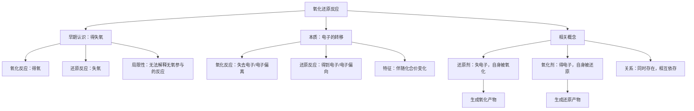
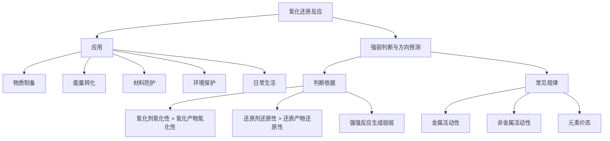

# 氧化还原反应 (教学设计)

> 📅 时间：2026-01-22 02:50 | 🕒 总课时：3

# 第1课时：从得失氧到电子转移——氧化还原反应的本质

## 环节一：学习目标

1.  **知识与技能**：
    1.  能够回顾并理解氧化还原反应基于得失氧的早期概念，并认识其局限性。
    2.  理解氧化还原反应的本质是电子的转移（包括电子的得失和电子的偏向）。
    3.  能够运用电子转移的观点，判断常见的氧化反应、还原反应。
    4.  能够辨析氧化剂、还原剂、氧化产物、还原产物等核心概念。
2.  **过程与方法**：
    1.  通过实验现象和生活实例，培养观察、分析、归纳的能力。
    2.  通过小组讨论和探究，培养合作学习和解决问题的能力。
3.  **情感态度与价值观**：
    1.  认识到化学概念是不断发展和完善的，培养科学探究精神。
    2.  体会化学与生活、生产的密切联系，激发学习化学的兴趣。

## 环节二：情景创设 (3分钟)

**教师活动**：
同学们，在初中我们学习过一些有趣的化学反应。请大家回忆一下，铁生锈、镁条燃烧、氢气还原氧化铜这些反应有什么共同点？（展示图片：生锈的铁钉、燃烧的镁条、氢气还原氧化铜的实验装置）

**学生思考与回答**：
学生可能会回答：都与氧气有关、都发生了化学变化、都生成了新物质等。

**教师追问，引发认知冲突**：
很好！这些反应确实都涉及氧气的得失。例如，铁生锈是铁与氧气反应，镁条燃烧是镁与氧气反应，氢气还原氧化铜是氧化铜失去氧气。我们把这类有得氧失氧的反应称为氧化还原反应。
那么，请大家思考一个问题：铁与硫酸铜溶液反应（Fe + CuSO₄ → FeSO₄ + Cu），这个反应中，有氧气的得失吗？（展示实验现象：铁钉表面附着红色物质，溶液颜色变浅）
这个反应没有氧气的得失，但它和前面提到的反应一样，都发生了元素的化合价变化。这说明我们对氧化还原反应的认识可能还不够全面。今天，我们就一起来深入探究氧化还原反应的本质！

## 环节三：任务驱动教学

### 任务一：回顾与挑战——从得失氧看氧化还原反应

**目标**：回顾初中氧化还原反应的定义，并认识其局限性，为引入电子转移概念做铺垫。

1.  **[自主学习] & [合作探究]** (10分钟)
    *   **教师引导**：请同学们回顾初中学习过的关于“氧化反应”和“还原反应”的定义，并结合以下两个反应进行分析：
        1.  碳在氧气中燃烧：C + O₂ → CO₂
        2.  氢气还原氧化铜：CuO + H₂ → Cu + H₂O
    *   **学生自主学习**：查阅初中笔记或教材相关内容，思考上述反应中哪些物质得氧，哪些物质失氧。
    *   **小组讨论**：
        *   在反应①中，哪个物质得氧？哪个物质被氧化？
        *   在反应②中，哪个物质失氧？哪个物质被还原？
        *   讨论：除了得失氧，这些反应还有没有其他共同的特征？（引导学生思考化合价变化）
    *   **教师提问**：我们情景创设中提到的“铁与硫酸铜溶液反应” (Fe + CuSO₄ → FeSO₄ + Cu)，如果用得失氧的观点来解释，能解释通吗？这说明了什么？

2.  **归纳小结** (3分钟)
    *   **早期认识**：
        *   **氧化反应**：物质**得氧**的反应。
        *   **还原反应**：物质**失氧**的反应。
        *   **氧化还原反应**：指有氧的得失的反应。
    *   **局限性**：很多不含氧的反应（如 Fe + CuSO₄ → FeSO₄ + Cu，2Na + Cl₂ → 2NaCl）也具有相似的特征（如化合价变化），不能用得失氧的观点来解释。这促使我们寻找更本质的定义。

3.  **评价训练** (2分钟)
    1.  下列反应中，属于氧化反应的是（ ）
        A. CaCO₃ → CaO + CO₂
        B. CuO + H₂ → Cu + H₂O
        C. C + O₂ → CO₂
        D. Fe₂O₃ + 3CO → 2Fe + 3CO₂
    2.  指出在反应 CuO + H₂ → Cu + H₂O 中，哪种物质被氧化，哪种物质被还原。

### 任务二：揭示本质——从电子转移看氧化还原反应

**目标**：引入电子转移的观点，理解氧化还原反应的本质，并能初步判断氧化反应和还原反应。

1.  **[合作探究]** (12分钟)
    *   **教师引导**：我们知道，原子是由原子核和核外电子构成的。在化学反应中，原子最外层电子的得失或共用是形成化学键的基础。
    *   **案例分析一**：以金属钠与氯气反应为例：2Na + Cl₂ → 2NaCl
        *   **教师提问**：钠原子和氯原子是如何形成氯化钠的？（引导学生从电子得失角度思考）
        *   **学生讨论**：
            *   Na原子：失去1个电子形成Na⁺。
            *   Cl原子：得到1个电子形成Cl⁻。
        *   **教师板书**：Na - e⁻ → Na⁺；Cl + e⁻ → Cl⁻
        *   **教师引导**：在这个反应中，钠原子失去了电子，氯原子得到了电子。那么，失去电子的过程和得到电子的过程分别对应我们之前提到的哪种反应类型？
    *   **案例分析二**：回到情景创设中的“铁与硫酸铜溶液反应”：Fe + CuSO₄ → FeSO₄ + Cu
        *   **教师引导**：硫酸铜溶液中存在Cu²⁺和SO₄²⁻。当铁钉放入溶液中，发生了什么？（引导学生思考铁与铜离子之间的电子转移）
        *   **学生讨论**：
            *   Fe原子：失去2个电子形成Fe²⁺。
            *   Cu²⁺离子：得到2个电子形成Cu。
        *   **教师板书**：Fe - 2e⁻ → Fe²⁺；Cu²⁺ + 2e⁻ → Cu
        *   **学生总结**：这两个反应的共同点是什么？（都有电子的转移）
    *   **教师总结并拓展**：对于共价化合物，虽然没有明显的电子得失，但原子间电子的**偏向**也会导致化合价的变化，本质上也是电子的转移。

2.  **归纳小结** (3分钟)
    *   **氧化还原反应的本质**是**电子的转移**（包括电子的得失和电子的偏向）。
    *   **氧化反应**：物质**失去电子**（或电子偏离）的反应。
    *   **还原反应**：物质**得到电子**（或电子偏向）的反应。
    *   **特征**：伴随着元素化合价的变化。

3.  **评价训练** (2分钟)
    1.  下列变化中，属于氧化反应的是（ ）
        A. H₂O → H₂ + O₂
        B. Cu²⁺ → Cu
        C. Fe → Fe²⁺
        D. Cl₂ → 2Cl⁻
    2.  用电子转移的观点解释反应 Zn + 2HCl → ZnCl₂ + H₂ 中，哪些原子失去电子，哪些原子得到电子。

### 任务三：明晰角色——氧化剂与还原剂

**目标**：掌握氧化剂、还原剂、氧化产物、还原产物的概念，并能准确判断其在具体反应中的角色。

1.  **[自主学习] & [合作探究]** (10分钟)
    *   **教师引导**：既然氧化还原反应是电子转移的过程，那么参与反应的物质在电子转移过程中扮演了怎样的角色？
    *   **学生自主学习**：阅读教材中关于“氧化剂”、“还原剂”、“氧化产物”、“还原产物”的定义。
    *   **小组讨论与填表**：以 2Na + Cl₂ → 2NaCl 和 Fe + CuSO₄ → FeSO₄ + Cu 为例，分析并填写下表：

        | 反应物 | 电子得失情况 | 发生反应类型 | 作用（是氧化剂/还原剂） | 自身变化（被氧化/被还原） | 生成产物类型 |
        | :----: | :----------: | :----------: | :----------------------: | :-----------------------: | :----------: |
        |   Na   |              |              |                          |                           |              |
        |   Cl₂  |              |              |                          |                           |              |
        |   Fe   |              |              |                          |                           |              |
        |  CuSO₄ |              |              |                          |                           |              |

    *   **教师巡视指导**，确保学生理解各概念间的关联。

2.  **归纳小结** (3分钟)
    *   **还原剂**：在反应中**失去电子**（或电子偏离）的物质，自身**被氧化**，发生氧化反应。
    *   **氧化剂**：在反应中**得到电子**（或电子偏向）的物质，自身**被还原**，发生还原反应。
    *   **氧化产物**：还原剂**被氧化后**的产物。
    *   **还原产物**：氧化剂**被还原后**的产物。
    *   **相互关系**：氧化还原反应中，氧化剂和还原剂**同时存在，相互依存**。氧化反应和还原反应**同时发生，互为因果**。

3.  **评价训练** (2分钟)
    1.  在反应 2Mg + O₂ → 2MgO 中，指出氧化剂、还原剂、氧化产物、还原产物。
    2.  下列关于氧化还原反应的说法正确的是（ ）
        A. 失去电子的物质是氧化剂
        B. 得到电子的物质发生氧化反应
        C. 氧化剂自身发生还原反应
        D. 还原产物是还原剂失去电子后的产物

## 环节四：课堂小结 (3分钟)

**教师引导**：通过本节课的学习，我们对氧化还原反应有了更深刻的认识。请大家尝试构建本课时的思维导图。

**学生绘制/教师板书**：



## 环节五：课堂检测 (5分钟)

1.  下列反应中，属于氧化还原反应的是（ ）
    A. HCl + NaOH → NaCl + H₂O
    B. CaCO₃ → CaO + CO₂
    C. Cl₂ + 2KBr → 2KCl + Br₂
    D. Fe(OH)₃ + 3HCl → FeCl₃ + 3H₂O

2.  分析反应 2H₂S + SO₂ → 3S + 2H₂O，指出：
    1.  哪个物质是氧化剂？哪个物质是还原剂？
    2.  哪个物质发生氧化反应？哪个物质发生还原反应？
    3.  氧化产物和还原产物分别是什么？

3.  根据电子转移的观点，判断下列叙述是否正确，并说明理由：
    1.  在氧化还原反应中，一定有元素的化合价发生变化。
    2.  失去电子的反应一定是氧化反应，得到电子的反应一定是还原反应。
    3.  氧化剂在反应中一定得到电子，还原剂在反应中一定失去电子。

---

# 第2课时：氧化态与氧化还原反应的判断

## 环节一：学习目标
1.  理解氧化态的概念，掌握常见元素在化合物或离子中的氧化态计算方法和规则。
2.  能运用氧化态的变化规律判断化学反应是否为氧化还原反应，并能准确指出反应中的氧化剂、还原剂、氧化产物和还原产物。
3.  通过分析氧化态的变化，加深对氧化还原反应本质（电子转移）的理解，并能用双线桥法表示电子转移的方向和数目。

## 环节二：情景创设 (3分钟)
**教师引导语：** 同学们，在上一课时我们学习了氧化还原反应，知道它是伴随电子转移的反应。例如，铁生锈是氧化还原反应，铜丝浸入硝酸银溶液中发生反应（Cu + 2AgNO₃ → Cu(NO₃)₂ + 2Ag）也是氧化还原反应。我们用电子得失来解释了它们。但是，对于像氢气与氯气反应生成氯化氢（H₂ + Cl₂ → 2HCl）这样的反应，没有氧元素的参与，我们如何更方便、更准确地判断电子的转移方向和程度呢？仅仅依靠“得失氧”或“电子得失”的直观判断，有时会遇到困难，甚至无法判断。今天，我们将引入一个更普遍、更精确的工具来分析氧化还原反应——**氧化态**。

## 环节三：任务驱动教学

### 任务一：认识氧化态及其计算规则

1.  **[自主学习]**
    *   **教师引导语:** 什么是氧化态？它与我们之前学过的化合价有什么区别和联系？请同学们阅读教材PXX（假设为P68-P69），结合预习内容，尝试给出氧化态的定义，并总结氧化态的计算规则。请特别注意氧化态与化合价在概念上的细微差别。
    *   **学生活动:** 学生独立阅读教材，思考并记录氧化态的定义和规则。教师巡视，解答学生初步疑问。
    *   **思考点：**
        *   氧化态是实际存在的电荷吗？
        *   为什么单质的氧化态为0？
        *   氧元素和氢元素在所有化合物中的氧化态都是固定的吗？

2.  **归纳小结**
    *   **教师组织:** 邀请几位学生分享他们对氧化态的定义和总结的规则。教师进行补充、纠正和强调，形成完整的板书或PPT展示。
    *   **核心内容：**
        *   **氧化态的定义：** 氧化态是化合物中元素化合价的假想电荷数，是根据原子间共用电子对的偏移情况，假定共用电子对完全偏向电负性较大的原子时，该原子所带的电荷数。它是一个形式电荷，不是真实电荷。
        *   **与化合价的联系与区别：** 氧化态与化合价在数值上常相同，但氧化态更强调“假想”和电子转移的倾向性，且适用于所有物质（包括单质），而化合价通常只用于化合物。
        *   **氧化态的计算规则：**
            1.  **单质中元素的氧化态为0。** (如：H₂, O₂, Fe, Cl₂)
            2.  **化合物中，氧元素通常为-2。** (特例：过氧化物H₂O₂中为-1，超氧化物KO₂中为-1/2，OF₂中为+2)
            3.  **化合物中，氢元素通常为+1。** (特例：金属氢化物NaH中为-1)
            4.  **金属元素在化合物中通常显正价。**
            5.  **IA族元素 (Li, Na, K等) 在化合物中为+1，IIA族元素 (Mg, Ca, Ba等) 为+2，氟元素为-1。**
            6.  **化合物中，各元素氧化态的代数和为0。**
            7.  **离子中，各元素氧化态的代数和等于离子所带的电荷数。**

3.  **评价训练**
    *   **题目1:** 计算下列物质中画线元素的氧化态：
        a) H₂**S**O₄ (S: +6)
        b) KMn**O**₄ (Mn: +7)
        c) N**H**₄Cl (N: -3)
        d) Fe₃**O**₄ (Fe: +8/3)
        e) N**O**₂⁻ (N: +3)
    *   **题目2:** 下列关于氧化态的说法中，正确的是（ ）
        A. 氧化态就是化合价，两者是同一个概念。
        B. 氧元素在所有化合物中都显-2价。
        C. 单质中元素的氧化态为0，这表明单质不具有氧化性或还原性。
        D. 氧化态是判断电子转移方向和数量的重要依据。
        *   **答案:** D (A错误，B错误，C错误，单质具有氧化性或还原性，如Cl₂作氧化剂，Na作还原剂)

### 任务二：利用氧化态判断氧化还原反应

1.  **[合作探究]**
    *   **教师引导语:** 我们已经掌握了氧化态的计算。现在，请同学们以小组为单位，分析以下反应，计算各元素在反应前后的氧化态，并讨论：
        *   如果反应中元素的氧化态发生了变化，这意味着什么？
        *   如何根据氧化态的变化来判断一个反应是否为氧化还原反应？
        *   如何根据氧化态的变化来区分氧化剂、还原剂、氧化产物、还原产物？
    *   **探究实例 (提供给小组):**
        a) CuO + H₂ → Cu + H₂O
        b) CaCO₃ + 2HCl → CaCl₂ + H₂O + CO₂
        c) 2KMnO₄ + 16HCl(浓) → 2KCl + 2MnCl₂ + 5Cl₂ + 8H₂O
    *   **学生活动:** 小组讨论，计算各反应中所有元素的氧化态，分析氧化态的变化规律，并尝试总结判断方法及概念对应关系。教师巡视指导，提醒学生关注电子转移的本质。

2.  **归纳小结**
    *   **教师组织:** 各小组汇报讨论结果。教师引导学生总结，并进行系统性的讲解和板书。
    *   **核心内容：**
        *   **氧化还原反应的判断依据：** 凡是有元素氧化态发生变化的化学反应，就是氧化还原反应；若所有元素的氧化态在反应前后均未发生变化，则不是氧化还原反应。
        *   **氧化还原反应的本质与氧化态的关系：**
            *   **氧化态升高**的元素：**失去电子**，被**氧化**，该物质作**还原剂**，生成**氧化产物**。
            *   **氧化态降低**的元素：**得到电子**，被**还原**，该物质作**氧化剂**，生成**还原产物**。
        *   **“三条线”法 (双线桥法初步引入):**
            *   **氧化剂 → 还原产物** (氧化态降低，得电子，被还原)
            *   **还原剂 → 氧化产物** (氧化态升高，失电子，被氧化)
            *   **电子转移方向** (从还原剂中失电子的元素指向氧化剂中得电子的元素)
            *   **电子转移数目** (氧化态变化的总数即为转移电子的总数)

3.  **评价训练**
    *   **题目1:** 判断下列反应是否为氧化还原反应。如果是，请指出氧化剂、还原剂、氧化产物、还原产物，并用双线桥法表示电子转移的方向和数目。
        a) 2Na + Cl₂ → 2NaCl
            *   Na (0 → +1, 升高, 失电子, 还原剂, 氧化产物)
            *   Cl (0 → -1, 降低, 得电子, 氧化剂, 还原产物)
            *   是氧化还原反应。双线桥：从Na指向Cl₂，转移2e⁻。
        b) Fe₂O₃ + 3CO → 2Fe + 3CO₂
            *   Fe (+3 → 0, 降低, 得电子, 氧化剂, 还原产物)
            *   C (+2 → +4, 升高, 失电子, 还原剂, 氧化产物)
            *   是氧化还原反应。双线桥：从CO中的C指向Fe₂O₃中的Fe，转移6e⁻。
        c) HCl + NaOH → NaCl + H₂O
            *   所有元素氧化态均未变化 (H: +1, Cl: -1, Na: +1, O: -2)。
            *   不是氧化还原反应。
    *   **题目2:** 在反应 3Cu + 8HNO₃(稀) → 3Cu(NO₃)₂ + 2NO + 4H₂O 中，
        被氧化的元素是**Cu**，被还原的元素是**N**，氧化剂是**HNO₃**，还原剂是**Cu**。
        *   (提示：Cu (0 → +2)，N (+5 → +2))

## 环节四：课堂小结
**思维导图结构：**

```mermaid
graph TD
    A[氧化还原反应] --> B[本质：电子转移]
    A --> C[判断工具：氧化态]

    C --> C1[定义：假想电荷数]
    C --> C2[计算规则]
        C2 --> C2a[单质：0]
        C2 --> C2b[O：通常-2 (特例)]
        C2 --> C2c[H：通常+1 (特例)]
        C2 --> C2d[IA族+1, IIA族+2, F-1]
        C2 --> C2e[化合物：代数和=0]
        C2 --> C2f[离子：代数和=离子电荷]

    C --> C3[判断依据：氧化态是否变化]
        C3 --> C3a[变化 --> 是氧化还原反应]
        C3 --> C3b[不变 --> 不是氧化还原反应]

    C --> C4[概念对应与电子转移]
        C4 --> C4a[氧化态升高]
            C4a --> C4a1[失电子]
            C4a --> C4a2[被氧化]
            C4a --> C4a3[还原剂]
            C4a --> C4a4[氧化产物]
        C4 --> C4b[氧化态降低]
            C4b --> C4b1[得电子]
            C4b --> C4b2[被还原]
            C4b --> C4b3[氧化剂]
            C4b --> C4b4[还原产物]
        C4 --> C4c[双线桥法表示电子转移方向和数目]
```

## 环节五：课堂检测

1.  **基础题:**
    下列关于氧化态的说法中，不正确的是（ ）
    A. 氧化态是表示元素化合价的一种形式。
    B. 氧元素在过氧化氢 (H₂O₂) 中的氧化态是-1。
    C. 单质中元素的氧化态为0，这表明单质不具有氧化性或还原性。
    D. 在化合物中，某元素的氧化态越高，其氧化性越强。
    *   **答案:** C (单质的氧化态为0，但它们可以表现出氧化性或还原性，如Cl₂是氧化剂，Na是还原剂。A、B、D是正确的表述。)

2.  **中等题:**
    分析下列反应：Fe + CuSO₄ → FeSO₄ + Cu
    (1) 该反应是否为氧化还原反应？请说明理由。
    (2) 指出反应中的氧化剂和还原剂。
    (3) 如果有0.1 mol Fe参与反应，转移了多少摩尔电子？
    *   **答案:**
        (1) 是氧化还原反应。理由：反应中Fe元素的氧化态从0升高到+2，Cu元素的氧化态从+2降低到0，有元素氧化态发生变化。
        (2) 氧化剂是CuSO₄ (或Cu²⁺)，还原剂是Fe。
        (3) 0.1 mol Fe (0 → +2) 失去 0.1 mol × 2 = 0.2 mol 电子。因此，转移了0.2摩尔电子。

3.  **提升题:**
    已知反应：KClO₃ + 6HCl(浓) → KCl + 3Cl₂ + 3H₂O
    (1) 请计算反应前后各元素的氧化态。
    (2) 指出该反应中的氧化剂和还原剂，并说明理由。
    (3) 若有1 mol KClO₃ 参与反应，有多少摩尔电子发生转移？
    *   **答案:**
        (1) 反应前：KClO₃ (K: +1, Cl: +5, O: -2)；HCl (H: +1, Cl: -1)。
            反应后：KCl (K: +1, Cl: -1)；Cl₂ (Cl: 0)；H₂O (H: +1, O: -2)。
        (2) 氧化剂是KClO₃，理由是其中Cl元素的氧化态从+5降低到0 (生成Cl₂)。
            还原剂是HCl，理由是其中Cl元素的氧化态从-1升高到0 (生成Cl₂)。
        (3) 在该反应中，KClO₃中的1个Cl原子从+5价变为0价，得到5个电子。6个HCl中，有5个Cl原子从-1价变为0价，共失去5个电子 (另外1个Cl原子仍为-1价，生成KCl)。
            因此，1 mol KClO₃ 参与反应，KClO₃提供1 mol Cl原子从+5到0，得到5 mol电子。同时，5 mol HCl提供5 mol Cl原子从-1到0，失去5 mol电子。
            所以，总共转移了5摩尔电子。

---

# 第3课时：氧化还原反应的应用与判断

## 环节一：学习目标
1.  **知识与技能**：
    1.1 理解氧化还原反应在生产生活中的重要应用，如金属腐蚀与防护、物质制备、能量转化等。
    1.2 掌握根据氧化还原反应的发生事实，初步判断氧化剂和还原剂的相对强弱。
    1.3 能运用氧化还原反应原理分析和解释一些常见的化学现象。
2.  **过程与方法**：
    2.1 通过案例分析、自主学习和小组讨论，培养学生分析问题、解决问题的能力。
    2.2 学习运用归纳、比较等科学方法，构建氧化还原反应的知识体系。
3.  **情感态度与价值观**：
    3.1 认识化学在解决实际问题中的价值，增强学习化学的兴趣和探究欲望。
    3.2 培养科学探究精神和严谨求实的科学态度。
    3.3 树立环境保护意识和资源节约意识。

## 环节二：情景创设 (3分钟)
**教师活动**：
展示一系列与氧化还原反应相关的图片或实物：
1.  生锈的铁钉、古铜器上的铜绿。
2.  正在工作的干电池或手机电池。
3.  超市货架上的漂白剂、消毒液。
4.  工业高炉炼铁的场景图片。

**学生思考**：
“同学们，这些现象或产品在我们的日常生活中随处可见。铁生锈、电池供电、漂白消毒、金属冶炼……它们看似毫无关联，但其背后都隐藏着一个共同的化学原理——我们前两节课学习的**氧化还原反应**。那么，这些现象是如何发生的？我们能否控制它们，甚至更好地利用它们？今天，我们就将深入探讨氧化还原反应在生产生活中的广泛应用，并学习如何判断氧化还原反应的强弱，从而预测反应的方向。”

**设计意图**：通过贴近生活和生产的实例，激发学生的学习兴趣，引发认知冲突，使学生认识到氧化还原反应的重要性，为本课时的学习奠定基础。

## 环节三：任务驱动教学

### 任务一：氧化还原反应在生产生活中的应用
*   **[合作探究]**
    *   **活动内容**：教师将学生分成若干小组，每组分发一份包含以下案例的材料，并要求小组讨论完成以下任务：
        *   **案例1：金属腐蚀与防护** (如钢铁生锈、铜绿生成)
            *   分析：铁生锈的化学方程式，指出氧化剂、还原剂及化合价变化。
            *   思考：如何利用氧化还原原理防止金属腐蚀？(如电化学保护法、牺牲阳极法、表面涂层等)
        *   **案例2：漂白与消毒** (如NaClO漂白、H₂O₂消毒)
            *   分析：漂白剂或消毒剂如何发挥作用？其有效成分的化合价如何变化？
            *   思考：这些物质的漂白或消毒原理是否都相同？
        *   **案例3：能量转化** (如原电池、燃料电池)
            *   分析：电池是如何将化学能转化为电能的？其中发生了哪些氧化还原反应？
            *   思考：日常生活中还有哪些能量转化与氧化还原反应有关？
        *   **案例4：物质制备** (如高炉炼铁、氯碱工业)
            *   分析：高炉炼铁（Fe₂O₃ + 3CO → 2Fe + 3CO₂）和氯碱工业（2NaCl + 2H₂O → 2NaOH + Cl₂ + H₂）中，哪些物质被氧化？哪些被还原？
            *   思考：这些工业生产利用了氧化还原反应的哪些特性？
    *   **小组汇报与交流**：各小组选派代表汇报讨论结果，其他小组补充或提问。
*   **归纳小结**
    *   氧化还原反应在生产生活中具有极其广泛的应用，主要体现在以下几个方面：
        *   **物质制备**：如金属冶炼（利用还原剂将金属氧化物还原）、非金属单质制备、酸碱盐的工业生产（如氯碱工业）。
        *   **能量转化**：如燃料燃烧（将化学能转化为热能）、各种电池（原电池、燃料电池将化学能转化为电能）。
        *   **材料防护**：如金属的防腐（通过电化学保护、牺牲阳极保护、表面涂层等方法阻止金属被氧化）。
        *   **环境保护**：如废水处理（氧化分解有机污染物）、烟气脱硫脱硝（将有害物质转化为无害物质）。
        *   **日常生活**：如漂白、消毒、食品保鲜、照相显影等。
    *   **核心思想**：理解这些应用都是通过控制电子的得失或化合价的变化来实现的。
*   **评价训练**
    1.  下列生产生活中，利用氧化还原反应原理的是 ( )
        A. 用食醋除去水壶中的水垢
        B. 用熟石灰改良酸性土壤
        C. 用氢氟酸刻蚀玻璃
        D. 用高炉炼铁
    2.  漂白粉是常用的消毒剂，其有效成分是次氯酸钙[Ca(ClO)₂]。请写出Ca(ClO)₂在水中与CO₂反应生成HClO的化学方程式，并指出该反应中氯元素的化合价变化情况。

### 任务二：氧化还原反应的强弱判断与方向预测
*   **[自主学习]**
    *   **阅读教材**：仔细阅读教材中关于氧化剂和还原剂相对强弱判断的部分。
    *   **分析案例**：
        1.  **反应一**：Zn + CuSO₄ → ZnSO₄ + Cu
            *   请指出反应中的氧化剂、还原剂、氧化产物、还原产物。
            *   根据反应的发生，判断Zn和Cu的还原性强弱，以及Cu²⁺和Zn²⁺的氧化性强弱。
        2.  **反应二**：2FeCl₃ + 2KI → 2FeCl₂ + I₂ + 2KCl
            *   请指出反应中的氧化剂、还原剂、氧化产物、还原产物。
            *   根据反应的发生，判断Fe³⁺和I₂的氧化性强弱，以及I⁻和Fe²⁺的还原性强弱。
    *   **总结规律**：根据上述分析，尝试归纳判断氧化剂和还原剂相对强弱的依据。
*   **归纳小结**
    *   **判断依据**：
        *   **氧化剂的氧化性强弱**：在氧化还原反应中，**氧化剂的氧化性强于氧化产物的氧化性**。
        *   **还原剂的还原性强弱**：在氧化还原反应中，**还原剂的还原性强于还原产物的还原性**。
        *   **口诀**：**“强强反应生成弱弱”**，即强氧化剂与强还原剂反应生成弱氧化产物和弱还原产物。
    *   **常见规律**：
        *   **金属活动性顺序**：金属活动性越强，其单质的还原性越强；其阳离子的氧化性越弱。
        *   **非金属活动性顺序**：非金属活动性越强，其单质的氧化性越强；其阴离子的还原性越弱。
        *   **元素价态**：
            *   元素处于最高价态时，只具有氧化性。
            *   元素处于最低价态时，只具有还原性。
            *   元素处于中间价态时，既有氧化性又有还原性。
        *   **电极电势**：(简单提及，不深入展开) 标准电极电势越大，氧化剂的氧化性越强，还原剂的还原性越弱。
*   **评价训练**
    1.  已知反应 ① 2FeCl₃ + 2KI → 2FeCl₂ + I₂ + 2KCl；反应 ② 2FeCl₂ + Cl₂ → 2FeCl₃。
        请判断Fe³⁺、I₂、Cl₂的氧化性由强到弱的顺序，并判断I⁻、Fe²⁺、Cl⁻的还原性由强到弱的顺序。
    2.  下列物质中，既有氧化性又有还原性的是 ( )
        A. H₂SO₄ (浓)
        B. Na₂O₂
        C. SO₂
        D. KMnO₄

## 环节四：课堂小结
**教师引导**：通过思维导图的方式，帮助学生梳理本课时所学知识。

**思维导图结构**：



## 环节五：课堂检测
1.  (基础题) 下列生产生活中，没有涉及氧化还原反应的是 ( )
    A. 铁锅生锈
    B. 燃放烟花
    C. 食醋除水垢
    D. 铜的冶炼
2.  (中等题) 已知以下反应：
    ① 2Fe³⁺ + 2I⁻ → 2Fe²⁺ + I₂
    ② 2Br⁻ + Cl₂ → 2Cl⁻ + Br₂
    ③ 2Fe²⁺ + Cl₂ → 2Fe³⁺ + 2Cl⁻
    根据上述反应，判断Fe³⁺、I₂、Cl₂、Br₂的氧化性由强到弱的顺序，并判断Fe²⁺、I⁻、Cl⁻、Br⁻的还原性由强到弱的顺序。
3.  (提升题) 某同学设计实验验证Fe³⁺的氧化性比I₂强，并验证I₂的氧化性比Br₂强。请写出实验步骤、现象和结论。
    (提示：可选用的试剂有KI溶液、FeCl₃溶液、KBr溶液、CCl₄等。)
    *   **实验步骤**：
        1.  取少量KI溶液于试管A中，滴加FeCl₃溶液，观察现象。
        2.  取少量KBr溶液于试管B中，滴加步骤1反应后的溶液（或直接加入I₂水溶液），观察现象，并加入CCl₄振荡。
    *   **预期现象与结论**：
        1.  试管A中溶液变黄（或棕黄色），说明生成了I₂。该现象证明了Fe³⁺的氧化性强于I₂。
        2.  试管B中无明显现象（若加入I₂水溶液），或加入CCl₄后，CCl₄层呈紫红色，说明I₂不能氧化Br⁻。
           (若用步骤1反应后的溶液，则现象为：加入CCl₄振荡后，CCl₄层呈紫红色，说明I₂不能氧化Br⁻。)
           该现象证明了I₂的氧化性弱于Br₂。
    *   **最终结论**：综合上述实验，氧化性强弱顺序为：Fe³⁺ > I₂ > Br₂。
       (注：此题旨在考察学生对氧化还原反应强弱判断原理的综合应用及实验设计能力。)

---

