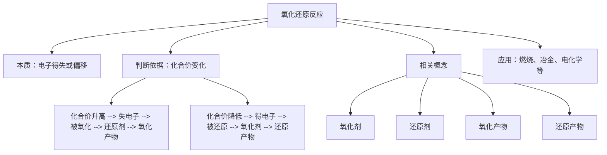

# ... (教学设计)

> 📅 时间：2026-01-23 22:13 | 🕒 总课时：1

# 第1课时：氧化还原反应的基本概念与判断

## 环节一：学习目标

1.  理解氧化还原反应的本质是电子的得失或共用电子对的偏移。
2.  掌握氧化剂、还原剂、氧化产物、还原产物等概念，并能识别它们。
3.  学会根据化合价变化判断氧化还原反应，并能分析电子转移的方向和数目。
4.  认识氧化还原反应在生产生活中的重要应用，培养宏观辨识与微观探析的化学核心素养。

## 环节二：情景创设 (3分钟)

**教师引导**：同学们，我们日常生活中经常看到铁制品生锈，或者镁条在空气中剧烈燃烧。在初中化学中，我们把这些与氧气发生的反应称为“氧化反应”。
*   **展示图片**：生锈的铁钉 (Fe → Fe₂O₃·nH₂O) 和镁条燃烧的剧烈现象 (Mg + O₂ → MgO)。

**设问1**：请大家回顾，初中是如何定义“氧化反应”的？
*   **(学生回答)**：物质与氧气发生的反应。

**设问2**：那么，反应 2Na + Cl₂ → 2NaCl (钠在氯气中燃烧) 中，有氧气参与吗？但我们通常也认为这是一个“氧化”过程。再比如，H₂ + Cl₂ → 2HCl (氢气在氯气中燃烧)，这个反应又有什么特点呢？
*   **(引发思考)**：学生可能会困惑，因为这些反应没有氧气参与，却表现出与“氧化”类似的某些特征。

**教师总结**：看来，我们初中学习的“氧化反应”定义有些局限性。为了更准确地描述这类反应，今天我们就来学习一个更广泛、更本质的概念——氧化还原反应。

## 环节三：任务驱动教学

### 任务一：探究氧化还原反应的本质

**[自主学习]** (10分钟)
1.  **回顾与思考**：
    *   请同学们思考，在初中学习的金属与酸反应 (如 Zn + H₂SO₄ → ZnSO₄ + H₂↑) 中，锌和氢元素的化合价发生了怎样的变化？
    *   在反应 2Na + Cl₂ → 2NaCl 中，钠原子和氯原子在形成化合物时，电子是如何转移的？
2.  **阅读教材**：仔细阅读教材中关于“氧化还原反应的本质”部分，重点关注电子的得失和共用电子对的偏移。
3.  **分析案例**：
    *   案例一：2Na + Cl₂ → 2NaCl。分析钠原子和氯原子得失电子的情况。
    *   案例二：H₂ + Cl₂ → 2HCl。分析氢原子和氯原子共用电子对的偏移情况。

**归纳小结** (3分钟)
*   **本质**：氧化还原反应的本质是电子的得失或共用电子对的偏移。
*   **氧化**：失去电子 (或共用电子对偏离)，化合价升高。
*   **还原**：得到电子 (或共用电子对偏向)，化合价降低。
*   **特征**：有元素化合价的变化。

**评价训练** (5分钟)
1.  判断下列反应中哪些是氧化还原反应，并说明判断依据：
    A. CaCO₃ + 2HCl → CaCl₂ + H₂O + CO₂
    B. 2Na + Cl₂ → 2NaCl
    C. N₂ + 3H₂ ⇌ 2NH₃
    D. NaOH + HCl → NaCl + H₂O
    *   **答案**：B、C是氧化还原反应。依据：B中Na、Cl元素化合价变化；C中N、H元素化合价变化。A、D中各元素化合价均未变化。
2.  在反应 2Na + Cl₂ → 2NaCl 中，请用双线桥法标明电子转移的方向和数目。
    *   **答案**：
        ```
        0      0          +1 -1
        2Na + Cl₂ → 2NaCl
        失2e⁻ (Na → Na⁺)
        得2e⁻ (Cl₂ → 2Cl⁻)
        ```
        (示意：Na失去电子给Cl₂)

### 任务二：辨析氧化剂、还原剂、氧化产物和还原产物

**[合作探究]** (12分钟)
1.  **分组讨论**：以小组为单位，选择以下任一氧化还原反应，分析其中各物质在反应中的作用，并尝试定义相关概念：
    *   Zn + CuSO₄ → ZnSO₄ + Cu
    *   CuO + H₂ $\xrightarrow{\Delta}$ Cu + H₂O
2.  **概念构建**：根据讨论结果，尝试给出氧化剂、还原剂、氧化产物、还原产物的定义，并思考它们之间的关系。

**归纳小结** (3分钟)
*   **氧化剂**：在反应中得到电子 (或共用电子对偏向)，化合价降低的物质。自身被还原。
*   **还原剂**：在反应中失去电子 (或共用电子对偏离)，化合价升高的物质。自身被氧化。
*   **氧化产物**：还原剂被氧化后的生成物。
*   **还原产物**：氧化剂被还原后的生成物。
*   **关系**：氧化剂→得电子→化合价降低→被还原→还原产物；还原剂→失电子→化合价升高→被氧化→氧化产物。

**评价训练** (5分钟)
1.  在反应 CuO + H₂ $\xrightarrow{\Delta}$ Cu + H₂O 中，指出氧化剂、还原剂、氧化产物、还原产物。
    *   **答案**：
        *   氧化剂：CuO (铜元素化合价由+2降为0)
        *   还原剂：H₂ (氢元素化合价由0升为+1)
        *   氧化产物：H₂O (H₂被氧化后的产物)
        *   还原产物：Cu (CuO被还原后的产物)
2.  下列物质中，既能作氧化剂又能作还原剂的是：
    A. H₂S
    B. Fe³⁺
    C. KMnO₄
    D. SO₂
    *   **答案**：D。H₂S中S为-2价，只能升高，作还原剂；Fe³⁺中Fe为+3价，只能降低，作氧化剂；KMnO₄中Mn为+7价，只能降低，作氧化剂；SO₂中S为+4价，可升高到+6，也可降低到0或-2，故既能作氧化剂又能作还原剂。

### 任务三：化合价升降与氧化还原反应的判断

**[自主学习]** (10分钟)
1.  **化合价规则**：复习初中化合价规则，并学习高中阶段更详细的化合价确定方法 (如单质化合价为0，化合物中O通常为-2，H通常为+1，离子化合物中离子所带电荷数即为化合价等)。
2.  **化合价与电子转移**：理解化合价升降与电子得失的内在联系：
    *   化合价升高 $\Leftrightarrow$ 失去电子 $\Leftrightarrow$ 被氧化
    *   化合价降低 $\Leftrightarrow$ 得到电子 $\Leftrightarrow$ 被还原
3.  **判断依据**：通过分析多个反应中各元素化合价的变化，总结判断氧化还原反应的简便方法。

**归纳小结** (3分钟)
*   **判断依据**：凡有元素化合价变化的反应，都是氧化还原反应。
*   **规律**：
    *   化合价升高 → 失电子 → 被氧化 → 还原剂 → 氧化产物
    *   化合价降低 → 得电子 → 被还原 → 氧化剂 → 还原产物
*   **口诀**：升失氧，降得还。

**评价训练** (5分钟)
1.  判断下列反应是否为氧化还原反应，并分析各元素化合价变化：
    A. 2KMnO₄ $\xrightarrow{\Delta}$ K₂MnO₄ + MnO₂ + O₂↑
    B. HCl + NaOH → NaCl + H₂O
    *   **答案**：
        *   A是氧化还原反应。KMnO₄中Mn由+7降为+6 (K₂MnO₄) 和+4 (MnO₂)，O由-2升为0 (O₂)。
        *   B不是氧化还原反应。各元素化合价均未变化。
2.  在反应 2H₂S + SO₂ → 3S↓ + 2H₂O 中，指出哪些元素被氧化，哪些元素被还原，并计算电子转移的数目。
    *   **答案**：
        *   H₂S中S元素化合价由-2升高到0，被氧化。
        *   SO₂中S元素化合价由+4降低到0，被还原。
        *   电子转移数目：2 mol H₂S 失去 2 × [0 - (-2)] = 4 mol 电子；1 mol SO₂ 得到 [0 - (+4)] = 4 mol 电子。故转移电子总物质的量为 4 mol。

## 环节四：课堂小结 (3分钟)

**教师引导**：通过本节课的学习，我们对氧化还原反应有了更深入的理解。现在，请同学们一起构建本课时的思维导图。



## 环节五：课堂检测 (8分钟)

1.  **基础题**：下列反应中，属于氧化还原反应的是：
    A. CuO + 2HCl → CuCl₂ + H₂O
    B. 2Fe + 3Cl₂ → 2FeCl₃
    C. CO₂ + H₂O → H₂CO₃
    D. Ba(OH)₂ + H₂SO₄ → BaSO₄↓ + 2H₂O
    *   **答案**：B (Fe由0升为+3，Cl由0降为-1)

2.  **中等题**：在反应 2KMnO₄ + 16HCl (浓) → 2KCl + 2MnCl₂ + 5Cl₂↑ + 8H₂O 中，
    (1) 氧化剂是_______，还原剂是_______。
    (2) 还原产物是_______，氧化产物是_______。
    (3) 标出电子转移的方向和数目。
    *   **答案**：
        (1) 氧化剂：KMnO₄；还原剂：HCl
        (2) 还原产物：MnCl₂；氧化产物：Cl₂
        (3)
        ```
        +7  -1          +2      0
        2KMnO₄ + 16HCl → 2KCl + 2MnCl₂ + 5Cl₂↑ + 8H₂O
        KMnO₄中Mn由+7降到+2，得5e⁻
        HCl中Cl由-1升到0，失1e⁻ (共10个Cl⁻失去10e⁻)
        ```
        (示意：KMnO₄得10e⁻，HCl失10e⁻)

3.  **提升题**：某反应的离子方程式为：3S²⁻ + 2MnO₄⁻ + 4H₂O → 3S↓ + 2MnO₂↓ + 8OH⁻。
    (1) 指出该反应中硫元素和锰元素的化合价变化。
    (2) 判断氧化剂和还原剂。
    (3) 若有 0.3 mol S²⁻ 参与反应，则转移的电子总物质的量是多少？
    *   **答案**：
        (1) 硫元素化合价由-2升高到0；锰元素化合价由+7降低到+4。
        (2) 氧化剂是MnO₄⁻；还原剂是S²⁻。
        (3) 3 mol S²⁻ 失去 3 × [0 - (-2)] = 6 mol 电子。
            则 0.3 mol S²⁻ 失去 0.3 × 2 = 0.6 mol 电子。
            因此，转移的电子总物质的量是 0.6 mol。

---

